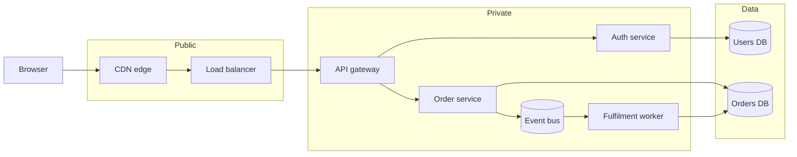
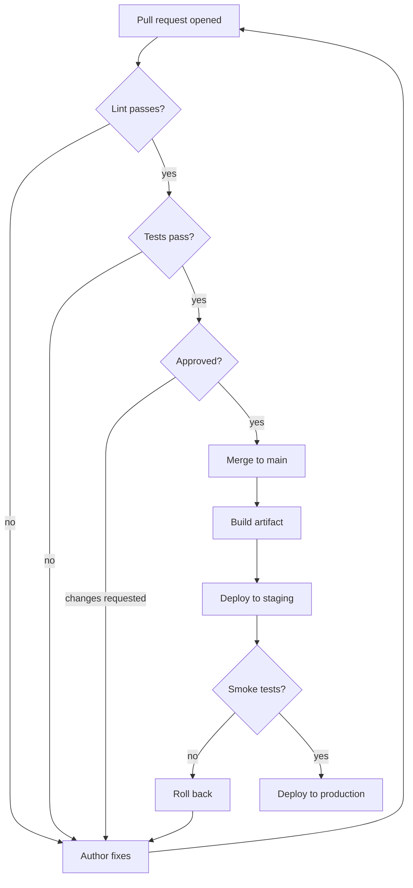
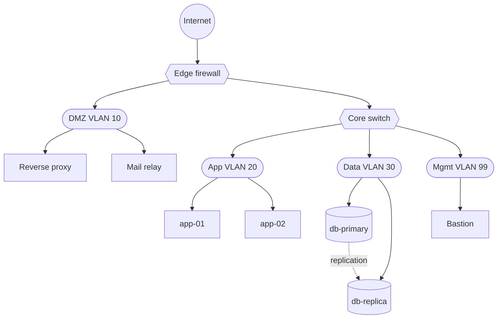
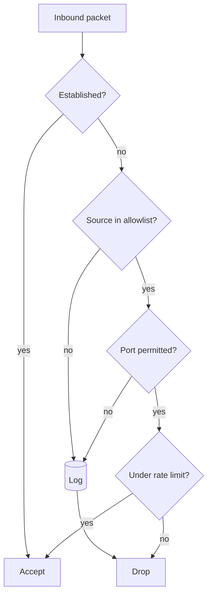
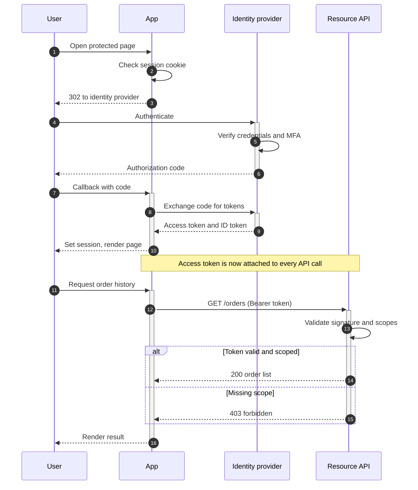
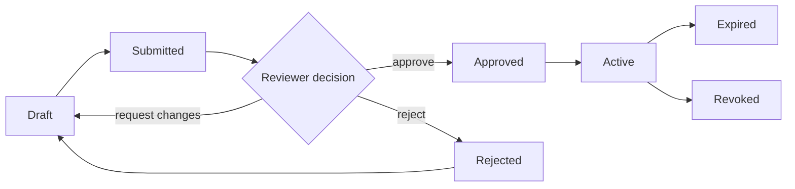
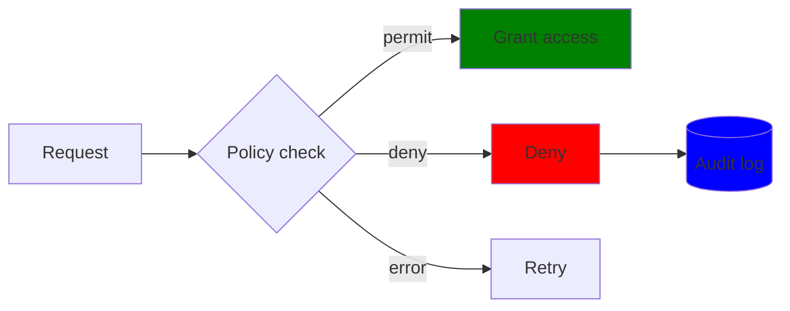

# Diagram examples

Every diagram here is rendered from the Mermaid fence printed above it, at build time, into
inline SVG. Nothing on this page ships JavaScript. See [Diagrams](diagrams.md) for the
supported syntax and [theming](diagrams.md#theming).

These are deliberately realistic rather than minimal — the point is to show what the layout
engine does with the density a real system produces.

## System architecture

Subgraphs are the tool for trust boundaries and deployment zones. Nested boxes nest, and a
node belongs to exactly one.

```
flowchart LR
  Client[Browser] --> CDN[CDN edge]

  subgraph Public
    CDN --> LB[Load balancer]
  end

  subgraph Private
    LB --> API[API gateway]
    API --> Auth[Auth service]
    API --> Orders[Order service]
    Orders --> Queue[(Event bus)]
    Queue --> Worker[Fulfilment worker]
  end

  subgraph Data
    Auth --> Users[(Users DB)]
    Orders --> OrderDB[(Orders DB)]
    Worker --> OrderDB
  end
```



Cylinders `[(…)]` read as datastores, so a reader can find the persistence layer without a
legend. Two edges converging on `OrderDB` from different services is the normal shape of a
shared database, and worth showing rather than hiding.

## Software delivery pipeline

Decision diamonds and failure paths are what make a pipeline diagram useful. A flow that only
shows the happy path documents nothing a reader could not guess.



Note the three edges returning to `Fix` from different layers. Those are the back edges the
layout engine reverses to break cycles, then draws in their original direction — a
retry loop stays readable instead of tangling the graph.

## Network topology

Shapes carry meaning here: hexagons for network equipment, stadiums for zones, rectangles for
hosts.



The dotted edge `-.->` distinguishes replication from routed traffic. Keeping one line style
per kind of relationship is more legible than colour, and it survives being printed.

## Firewall decision flow



Two paths converge on `Log` and two on `Drop`. Edges crossing the same horizontal gutter are
given separate lanes, so converging paths stay distinguishable rather than merging into one
line.

## Authorization sequence

Sequence diagrams suit protocol exchanges better than flowcharts, because the ordering *is*
the content.



`autonumber` numbers the messages, `+`/`-` open and close activation bars, `Note over` spans
two participants, and `alt`/`else` frames the branch. The self-message on `A` (checking the
session) draws as a loop against its own lifeline.

## Approval lifecycle

A state machine drawn as a flowchart. `stateDiagram` is not supported yet — see
[what is not supported](diagrams.md#what-is-not-supported) — and a flowchart carries the same
information.



## Using semantic colour

`classDef` and `:::` attach a class rather than a literal colour, so the palette follows the
site theme and both light and dark stay correct.



The `fill:` values are parsed and deliberately ignored — the class name is what reaches the
SVG, and the stylesheet decides the colour. That is what keeps a diagram legible when a reader
switches to dark mode.

Available classes: `primary`, `secondary`, `success`, `warning`, `danger`, `info`, `muted`.

## Keeping large diagrams readable

A diagram wider than the content column keeps its natural size and scrolls inside its own
figure rather than being scaled down until the labels are unreadable. If you find yourself
scrolling a lot, that is usually the diagram telling you it wants splitting — the same
judgement as [sections in one page](../structuring/sections-in-one-page.md).

Three things that help more than styling:

| Habit | Why |
|:---|:---|
| One direction per diagram | Mixing `TD` and `LR` thinking produces a graph that reads in neither |
| Names, not IDs, in labels | `A[Auth service]` beats `A`; the id is for you, the label is for the reader |
| Subgraphs for boundaries only | A box that means nothing costs a reader as much as one that does |
