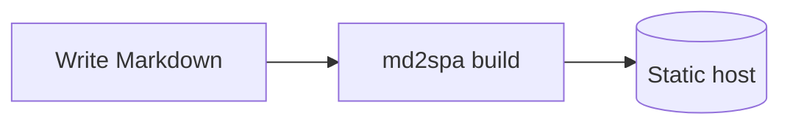
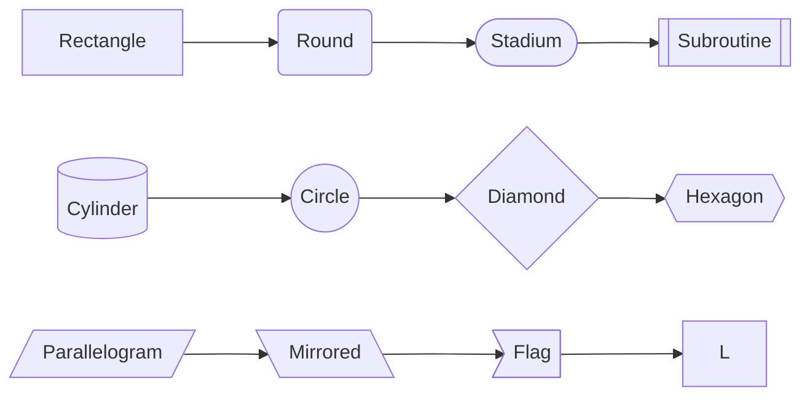
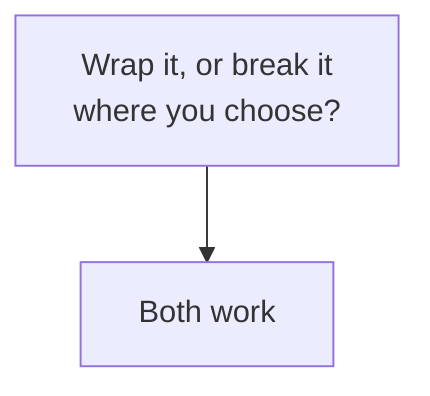
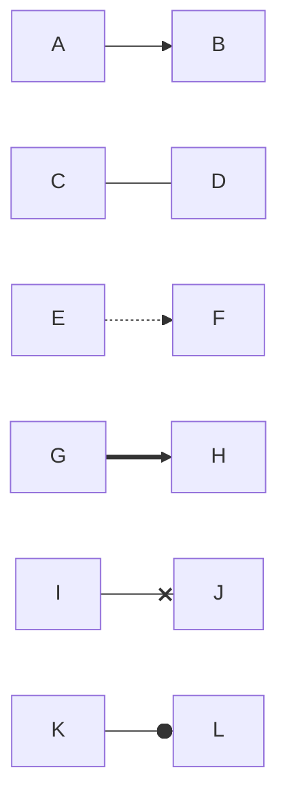
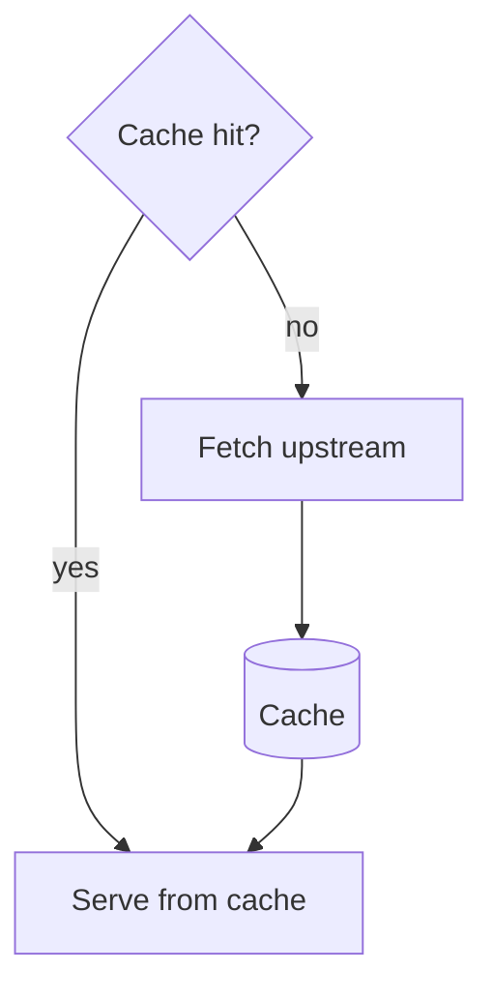
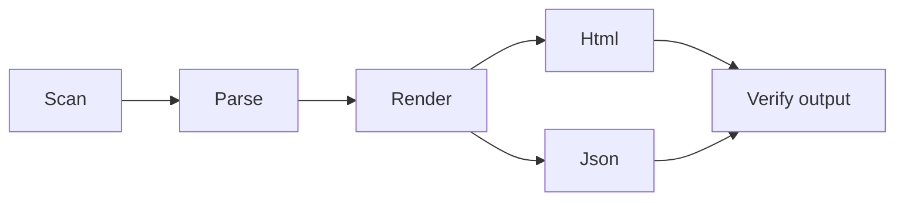
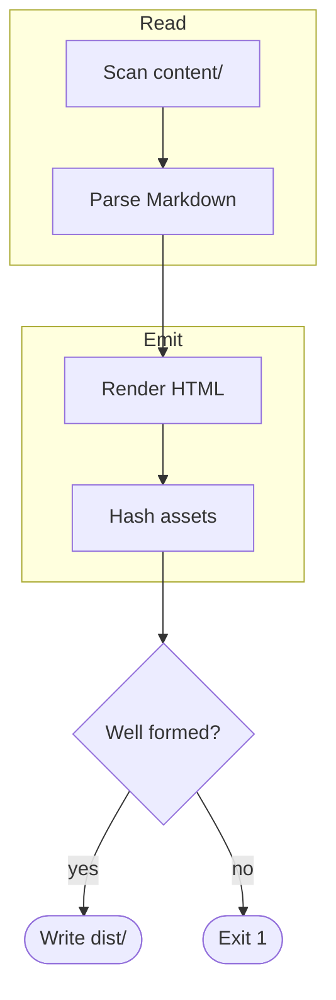
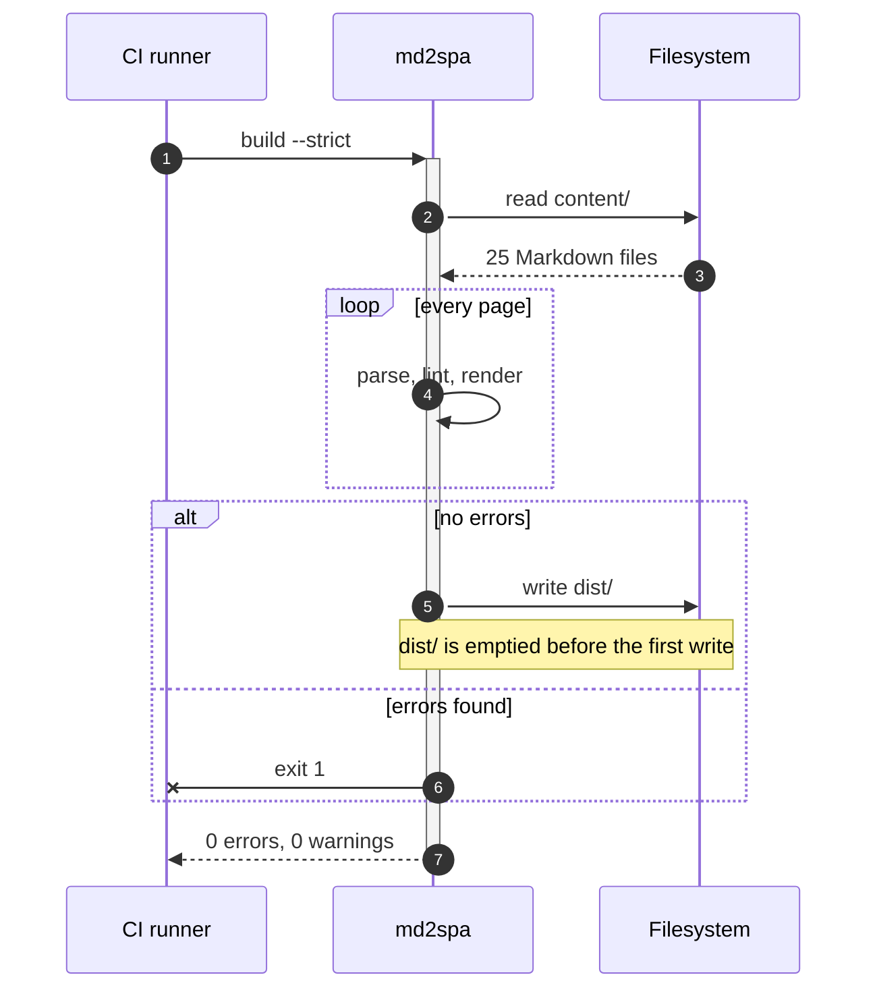
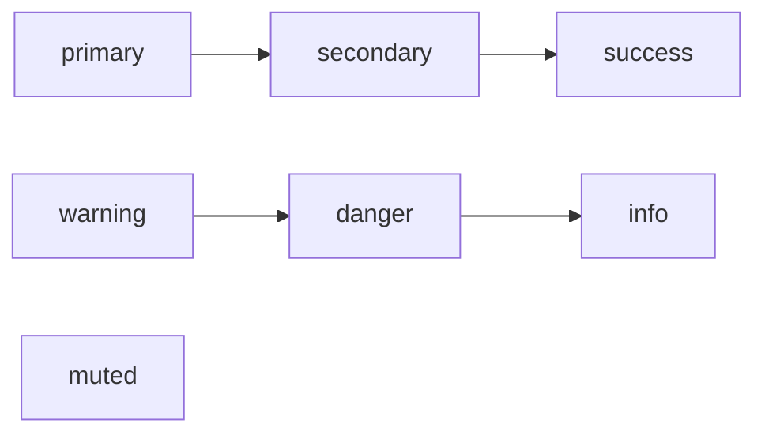

# Diagrams

A fence tagged `mermaid` is drawn while the site builds and inlined into the page as SVG.
No diagramming library reaches the reader, so a page with ten diagrams still ships zero
bytes of script for them. They render with JavaScript disabled, they print, they scale
with the page, and they follow the site theme in light and dark — every colour comes from
a CSS custom property rather than from an attribute baked into the SVG.

What md2spa understands is a **subset of Mermaid**: flowcharts, written `graph` or
`flowchart`, and sequence diagrams, written `sequenceDiagram`. The rest of Mermaid's
catalogue is [not supported](#what-is-not-supported) and falls back to a code block.

## A first diagram

~~~markdown

~~~


`mmd` is accepted as an alias for the language id. `%%` starts a comment line, which is
the only way to leave a note in the source that does not appear in the picture.

## Direction

`graph` and `flowchart` are synonyms. The word after either one sets the direction.

| Keyword | Layout |
|:---|:---|
| `TD` or `TB` | top to bottom |
| `BT` | bottom to top |
| `LR` | left to right |
| `RL` | right to left |

Layout is always computed top-down and flipped at the end, so the same source produces
the same shape in every orientation. Inside a `subgraph`, a `direction` line overrides it
for that box only.

## Node shapes



`L` in that last chain is declared bare: no brackets, so the id is the label.

| Syntax | Shape | Class on the group |
|:---|:---|:---|
| `A[Text]` | rectangle | `dg-node--rect` |
| `A(Text)` | rounded rectangle | `dg-node--round` |
| `A([Text])` | stadium | `dg-node--stadium` |
| `A[[Text]]` | subroutine | `dg-node--subroutine` |
| `A[(Text)]` | cylinder | `dg-node--cylinder` |
| `A((Text))` | circle | `dg-node--circle` |
| `A{Text}` | diamond | `dg-node--diamond` |
| `A{{Text}}` | hexagon | `dg-node--hexagon` |
| `A[/Text/]` | parallelogram | `dg-node--parallelogram` |
| `A[\Text\]` | parallelogram, mirrored | `dg-node--parallelogram-alt` |
| `A>Text]` | flag | `dg-node--flag` |
| `A` | rectangle; the id is the label | `dg-node--rect` |

A node keeps the shape it was first given. Later references need only the id, so declare
the label once and refer to it by id everywhere else.

Label text may be `"quoted"`, which is how you get punctuation that would otherwise close
the shape. `<br/>` forces a line break; long labels wrap on their own, at a width the
builder measures from the font metrics.



## Edges



| Syntax | Line |
|:---|:---|
| `A --> B` | solid, arrowhead |
| `A --- B` | solid, no head |
| `A -.-> B` | dotted, arrowhead |
| `A ==> B` | thick, arrowhead |
| `A --x B` | solid, ending in a cross |
| `A --o B` | solid, ending in a circle |

Edge endpoints are computed against the shape outline rather than its bounding box, so an
arrow into a diamond or a circle touches the border instead of stopping short of it.

### Labels

Two forms, identical in effect. Use the pipe form for short words and the inline form
when the label reads as part of the sentence.



Labels sit on an opaque plate, so the line never runs through the text.

### Chains and fan-out

An edge statement can carry several links, and `&` joins nodes on either side.



## Subgraphs

`subgraph Name` opens a labelled box and `end` closes it. Boxes nest, and a nested box is
drawn inside its parent.



Layer spacing is widened where a box would otherwise collide with a node, which is why a
diagram with subgraphs is taller than the same diagram without them.

## Sequence diagrams



### Participants

| Syntax | Effect |
|:---|:---|
| `participant A` | a column labelled `A` |
| `participant A as CI runner` | a column labelled "CI runner", referred to as `A` |
| `actor A as Reader` | the same, drawn as an actor |

A name used in a message but never declared is created automatically, in first-appearance
order, and reported as `MD082`. That warning is worth keeping on: a mistyped id becomes a
new participant rather than an error.

Columns are widened when a message label would not otherwise fit between two lifelines,
so a message never overlaps a lifeline that is not its endpoint. On a diagram taller than
about 520px the participant boxes repeat at the bottom.

### Messages

| Syntax | Line |
|:---|:---|
| `A->>B: text` | solid, filled arrowhead |
| `A-->>B: text` | dashed, filled arrowhead |
| `A->B: text` | solid, open arrowhead |
| `A-)B: text` | solid, open async arrowhead |
| `A--)B: text` | dashed, open async arrowhead |
| `A-xB: text` | solid, ending in a cross |
| `A->>A: text` | a self-message, drawn as a loop to the right of the lifeline |

`autonumber` prefixes every message with a sequential number.

### Activations

`activate A` and `deactivate A` draw the bar explicitly. The shorthand puts it on the
message: `+` after the arrow activates the receiver, `-` deactivates the sender. Bars
nest, each level offset a few pixels from the one below.

An `activate` with no matching `deactivate` — or the reverse — is `MD081`, an error.

### Notes and blocks

| Syntax | Effect |
|:---|:---|
| `Note left of A: text` | a note beside one lifeline |
| `Note right of A: text` | the same, on the other side |
| `Note over A,B: text` | a note spanning two lifelines |
| `loop label` … `end` | a labelled frame around the enclosed messages |
| `opt label` … `end` | the same, for an optional path |
| `alt label` … `else label` … `end` | a frame with a dashed divider at each `else` |
| `par label` … `and label` … `end` | a frame with a divider at each `and` |
| `critical label` … `end` | a labelled frame |
| `break label` … `end` | a labelled frame |
| `rect` … `end` | a plain band; any colour argument is ignored |

Frames nest, and each level is inset from its parent.

## Theming

Seven class names are styled by default. Apply one with `:::` after the node, or with a
`class` statement listing several ids.



They map onto the same colour ramp as [admonitions](admonitions.md) and badges, so a
`danger` node is the red the rest of the site uses. Any other name works too — it becomes
a `node--<name>` class, unstyled, ready for your own CSS.

`classDef` is accepted so that Mermaid written elsewhere still parses, but its colour
declarations are ignored and reported at info severity. Only the name survives. This is
deliberate: a literal `fill:#eee` is unreadable in dark mode and cannot be overridden.

### Custom properties

Every diagram is scoped by `.diagram`, which declares the variables the SVG paints with.
Override any of them in your own stylesheet.

| Property | Paints |
|:---|:---|
| `--dg-node-bg` | node fill |
| `--dg-node-border` | node stroke |
| `--dg-node-fg` | label text |
| `--dg-edge` | edge lines and arrowheads |
| `--dg-edge-label-bg` | the plate behind an edge label |
| `--dg-subgraph-bg` | subgraph box fill |
| `--dg-subgraph-border` | subgraph box stroke |
| `--dg-subgraph-fg` | subgraph title |
| `--dg-note-bg` | sequence note fill |
| `--dg-note-border` | sequence note stroke |
| `--dg-accent` | highlighted parts: activations, dividers |
| `--dg-font` | font family for every label |
| `--dg-font-size` | base label size |
| `--dg-stroke` | stroke width, `1.5px` |

Each one defaults to a theme variable rather than a literal — nodes take `--bg-subtle` and
`--border-strong`, labels take `--text`, edge label plates take `--bg`, and `--dg-accent`
follows the site accent. That is why a diagram tracks a retheme without being touched.

### The `theme.diagram` config block

For a site-wide change, set the values in the config instead of writing CSS. They are
emitted as custom properties in the same pass as `theme.accent`.

```json
{
  "theme": {
    "diagram": {
      "nodeBg": "#f6f8fa",
      "nodeBorder": "#c9d1d9",
      "nodeFg": "#14161a",
      "edge": "#8b949e",
      "accent": "#0b6bcb",
      "fontSize": "0.8125rem"
    }
  }
}
```

Each key is optional and sets one property: `nodeBg`, `nodeBorder`, `nodeFg`, `edge` and
`accent` map to `--dg-node-bg`, `--dg-node-border`, `--dg-node-fg`, `--dg-edge` and
`--dg-accent`; `fontSize` maps to `--dg-font-size`. The values apply to both themes, so a
fixed colour has to hold contrast in both — a variable of your own, set under each theme's
selector, usually reads better. See the
[configuration reference](../reference/config-reference.md#themediagram).

## What the build emits

```html
<figure class="diagram diagram--flowchart" role="img" aria-label="Flowchart: Scan, Parse, Render">
  <svg class="diagram__svg" viewBox="0 0 480 220" width="480" height="220"
       preserveAspectRatio="xMidYMid meet" xmlns="http://www.w3.org/2000/svg">
    <title>…</title><desc>…</desc>
    <defs><marker id="d1-arrow">…</marker></defs>
    <g class="dg-subgraphs">…</g>
    <g class="dg-edges">
      <g class="dg-edge dg-edge--dotted"><path class="dg-edge__line"/>…</g>
    </g>
    <g class="dg-nodes">
      <g class="dg-node dg-node--diamond node--danger">
        <path class="dg-node__shape"/>
        <text class="dg-node__label"><tspan>…</tspan></text>
      </g>
    </g>
  </svg>
</figure>
```

Sequence diagrams use `diagram--sequence` and add `.dg-lifeline`, `.dg-participant`,
`.dg-activation`, `.dg-message`, `.dg-note` and `.dg-block`, each with the same `__box`,
`__line` and `__label` children.

Three properties of that markup are worth knowing:

- **No `style`, `fill` or `stroke` attribute appears anywhere.** Classes only. This is
  what makes a diagram themeable, and it is the reason md2spa draws them itself instead
  of shipping Mermaid.
- **Marker ids are prefixed per diagram** — `d1-arrow`, `d2-arrow` — so two diagrams on
  one page never claim the same id. The prefix comes from the diagram's position on the
  page, not from a random value, so builds stay byte-identical.
- **The figure carries `role="img"` and a summarising `aria-label`**, and the SVG carries
  `<title>` and `<desc>`. A screen reader gets a sentence, not a list of coordinates,
  which is exactly why the surrounding prose still has to say what the diagram says.

A diagram wider than the content column scrolls inside its figure. The page never scrolls
sideways.

## Lines that are parsed and ignored

| Line | What happens |
|:---|:---|
| `%% comment` | dropped |
| `%%{init: {...}}%%` | ignored, reported as `MD083` |
| `style A fill:#f00` | parsed, ignored |
| `classDef name fill:#f00` | the name is kept, the declarations are ignored |
| `click A "https://…"` | parsed, ignored |
| `linkStyle 0 stroke:#f00` | ignored |

They are accepted rather than rejected so that a diagram pasted from another site still
renders. Nothing that hard-codes a colour is honoured, in any of these forms.

## Limits

A diagram over any of these is not drawn. The fence renders as a code block and the build
reports `MD084`.

| Limit | Value |
|:---|:---|
| Nodes | 300 |
| Edges | 600 |
| Participants | 60 |
| Messages | 400 |

These are well past the point where a diagram stops communicating. A picture with 300
nodes in it is a database, and the fix is several diagrams rather than a bigger one.

## What is not supported

| Diagram type | Keyword |
|:---|:---|
| Class diagram | `classDiagram` |
| State diagram | `stateDiagram`, `stateDiagram-v2` |
| Entity relationship | `erDiagram` |
| Gantt chart | `gantt` |
| Pie chart | `pie` |
| User journey | `journey` |
| Git graph | `gitGraph` |
| Mindmap | `mindmap` |
| Timeline | `timeline` |
| Quadrant chart | `quadrantChart` |
| Requirement diagram | `requirementDiagram` |
| Architecture and C4 | `architecture-beta`, `C4Context` |
| Charts | `sankey-beta`, `xychart-beta`, `block-beta` |

None of these fails the build. The fence renders as an ordinary code block, exactly as it
would have without diagram support, and the build records `MD080` at info severity so the
finding is visible without being fatal.

> [!TIP]
> For a picture md2spa cannot draw, commit an SVG and link it. Hand-written SVG with
> `currentColor` strokes is theme-aware for the same reason a diagram is. See
> [Links and assets](links-and-assets.md#images).

## Diagnostics

| Code | Severity | Fires when |
|:---|:---|:---|
| `MD080` | info | The diagram type is not supported, or the diagram declares nothing to draw; the fence renders as code |
| `MD081` | error | A line the parser cannot read |
| `MD082` | warning | A node or participant is used without being declared |
| `MD083` | info | A `%%{init}%%` directive was ignored |
| `MD084` | warning | The diagram is over the size limits and was not drawn |

`MD081` is an error, and errors are always fatal, so a broken diagram fails the build
rather than shipping a wrong picture. The full list is in
[Diagnostics](../reference/diagnostics.md#diagrams).

## Turning it off

```json
{ "mermaid": false }
```

Every `mermaid` fence then stays a code block, and none of `MD080` to `MD084` can fire.
That is the setting for a site that already renders diagrams client-side and only wants
md2spa to leave the source alone.
