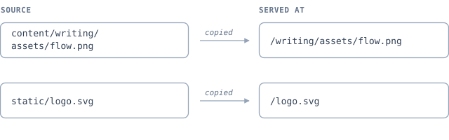

# Links and assets

Write links the way you would in a repository README: as relative paths to the `.md` file.
md2spa rewrites them to routes at build time and tells you when one points at nothing.

## Why relative Markdown links

A link like `../reference/cli.md#build` works in four places at once:

- Your editor's Markdown preview, which follows it to the file on disk.
- The repository web UI on GitLab or GitHub, which renders the target file.
- The built site, where md2spa has rewritten it to `../../reference/cli/#build`.
- A `grep` over the source tree, which finds every page that points at the CLI reference.

An absolute route such as `/reference/cli/` only works in the last case, and only if the
site is deployed at the root. That is why relative `.md` links are the house style.

## The rewriting rules

The target is resolved against the **source file's directory**, normalised, stripped of
its `.md` or `.markdown` extension, and `index.md` is mapped to the directory route. The
query and fragment are preserved. The result is then emitted through the same URL helper
as every other link, so all three `base` modes work identically.

Authored in `content/writing/links-and-assets.md`:

| Written | Rendered href |
|:---|:---|
| `markdown-syntax.md` | `../markdown-syntax/` |
| `advanced/footnotes.md` | `../advanced/footnotes/` |
| `../reference/cli.md` | `../../reference/cli/` |
| `../reference/cli.md#build` | `../../reference/cli/#build` |
| `index.md` or `./` | `../` |
| `#images` | `#images` (unchanged) |
| `https://example.com/` | unchanged, marked external |
| `mailto:docs@example.com` | unchanged |

Here they are as live links: [Markdown syntax](markdown-syntax.md),
[Footnotes](advanced/footnotes.md), [the CLI reference](../reference/cli.md),
[the build command](../reference/cli.md#build), [this section's index](index.md), and
[the images section further down](#images).

## Anchors

A fragment is checked against the heading ids of the target page. If the page exists but
has no heading with that id, the build reports `MD045` at warning severity and leaves the
link alone — a wrong anchor is a broken promise, not a broken page.

Heading ids come from the heading text; see [Markdown syntax](markdown-syntax.md#headings)
for the slug rules. The reliable way to get one right is to open the target page and copy
the permalink from the `#` that appears when you hover the heading.

> [!IMPORTANT]
> Anchor checking is what makes large refactors safe. Rename a heading, run
> `md2spa check`, and every page that pointed at the old anchor is listed with a line
> number.

## External links

Any URL with a scheme is left untouched and marked up as external. It gets
`target="_blank"`, a `rel` attribute of `noopener noreferrer external`, and a small
trailing icon so a reader knows the click leaves the site.
Example: [the CommonMark spec](https://spec.commonmark.org/current/).

Autolinks get the same treatment: <https://spec.commonmark.org/current/>.

`mailto:`, `tel:`, `sms:`, `irc:`, `matrix:` and `xmpp:` URLs pass through unchanged and
are not marked external, because they do not open a page. Anything with an unsafe scheme —
`javascript:` most obviously — is dropped and reported. See
[Custom HTML](advanced/custom-html.md) for the full URL policy.

## Images

`` uses the same path resolution as links.

```markdown

```


### Two places an image can live

Both work, and both are copied into the built site at the path the markup points at.

| Where the file lives | Written as | Served at |
|:---|:---|:---|
| `static/logo.svg` | `../../logo.svg` | `/logo.svg` |
| `content/writing/assets/flow.png` | `assets/flow.png` | `/writing/assets/flow.png` |



Use `static/` when the asset is shared across many pages, or when a host expects it at a
fixed path. Co-locate under `content/` when the image belongs to one page — it then moves
with the page and is deleted with it.

`static/` is copied verbatim to the site root, so `static/logo.svg` is addressed from a
file in `content/writing/` as `../../logo.svg`: up out of `writing/`, up out of `content/`,
then down to the asset at the root of the site.

Co-locating is usually the better default for a diagram that illustrates one page. Every
non-Markdown file under `contentDir` is copied to the same relative path in the output, so
`` resolves without configuration — and the file renders the same way
when someone reads the Markdown on GitLab or GitHub, because the path is a real one. Move
the page to another folder and the image moves with it.

If the same name exists in both trees, `static/` wins.

!!! tip "Remote images pass through untouched"
    `` is emitted exactly as written. Nothing is downloaded
    or rewritten, so nothing is validated either — a remote URL that rots is not something
    the build can see. Prefer a checked-in file for anything you rely on.

Images render with `loading="lazy"` and `decoding="async"` and are capped at the width of
the content column. An image whose alt text is empty is reported as `MD043`; an image
whose file cannot be found under `staticDir` or `contentDir` is reported as `MD046`.

Write alt text that replaces the image rather than describing it. "Architecture diagram"
tells a screen-reader user nothing; "The CLI calls the builder, which calls the parser and
the renderer in turn" tells them what the diagram says.

## Assets that are not images

Link to a downloadable asset exactly as you would link to a page: a relative path, no
`.md` extension to strip. The path is resolved and its existence is checked, so a renamed
attachment is caught by the same `MD046` that catches a renamed image.

```markdown
[Download the sample config](../../samples/md2spa.config.json)
[As a forced download](../../samples/site.zip)
```

The same choice applies as for images: a download shared across the site belongs in
`static/`, one that belongs to a single page can sit beside it in `content/`.

One thing to watch when co-locating: everything under `contentDir` is scanned, so a stray
`.md` file dropped into an assets folder becomes a page. Prefix the folder with `_` to keep
it out of the build entirely, or keep the assets in `static/` where nothing is parsed.

## Diagnostics for links

| Code | Severity | Fires when |
|:---|:---|:---|
| `MD040` | error | A bracket or parenthesis is never closed |
| `MD041` | error | `[text][ref]` has no matching definition |
| `MD042` | error | The destination is empty: `[text]()` |
| `MD043` | warning | An image has no alt text |
| `MD044` | error | An internal link points to a page that does not exist |
| `MD045` | warning | The anchor does not exist on the target page |
| `MD046` | warning | A local asset does not exist |
| `MD047` | info | A bare URL was linkified |
| `MD048` | info | A link reference definition is never used |

`MD044` and `MD045` are the two that pay for the whole linter. They turn "somebody will
notice the broken link eventually" into a build failure with a line number.

## When a page moves

Record the routes it used to live at in the new page's frontmatter:

```yaml
---
title: Base paths
redirect_from:
  - /deploying/subpaths/
  - /guide/base/
---
```

`redirect_from` is a known frontmatter key, type-checked as an array of strings and kept
on the page object. Every internal link to the old location is still reported by `MD044`,
so the first thing to do after a move is run `md2spa check` and fix the callers.

For readers who have the old URL bookmarked, add a redirect at the hosting layer — a
`_redirects` file, an `nginx` rule, or a rewrite in `netlify.toml`. Examples for each host
are in [Other hosts](../deploying/other-hosts.md).
